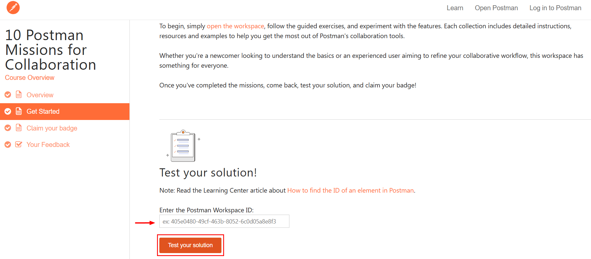
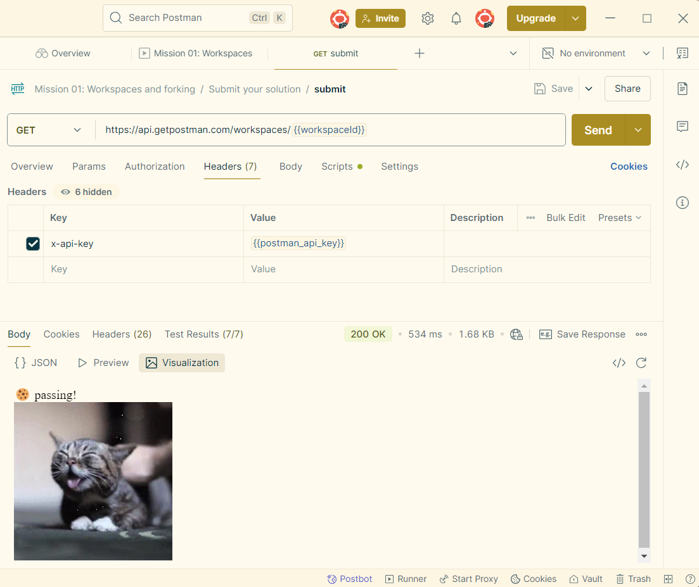

  

[](https://academy.postman.com/)  

Repository to save my path in learning modules of Self-Study Learning in site [Postman Academy](https://academy.postman.com/).

<!-- TOC -->

- [Challenge: POST add book](#challenge-post-add-book)
  - [Library Books API : POST add books Test.](#library-books-api-post-add-books-test)
  - [Library Books API  : GET all books Tests](#library-books-api-get-all-books-tests)
  - [Library Books API  : GET book by id Documentation](#library-books-api-get-book-by-id-documentation)
  - [Weather API  : GET weekly weather Visualizations](#weather-api-get-weekly-weather-visualizations)
- [API authentication and authorization](#api-authentication-and-authorization)
- [10 Postman Missions for Collaboration](#10-postman-missions-for-collaboration)
  - [Mission 01: Workspaces and forking](#mission-01--workspaces-and-forking)
  - [Mission 02: Requests, collections and environments](#mission-02--requests--collections-and-environments)
  - [Mission 03: Variables and authorization](#mission-03--variables-and-authorization)
  - [Mission 04: Tests and debugging](#mission-04--tests-and-debugging)
  - [Mission 05: Scripting](#mission-05--scripting)
  - [Mission 06: Run a collection](#mission-06--run-a-collection)
  - [Mission 07: Discoverability and collaboration](#mission-07--discoverability-and-collaboration)
  - [Mission 08: Mock servers and monitors](#mission-08--mock-servers-and-monitors)
  - [Mission 09: Advanced testing](#mission-09--advanced-testing)
  - [Mission 10: Submit for badge](#mission-10--submit-for-badge)
- [Postman Badges](#postman-badges)
- [Postman Certificates](#postman-certificates)
- [Contributors](#contributors)

<!-- TOC -->
 
## Challenge: POST add book
#### Library Books API : POST add books Test.

1. Fork the Library Books API from the [Public API Essentials Workspace](https://www.postman.com/devrel/api-essentials/overview?utm_campaign=fy25--global-all-api_essentials_collaboration-&utm_medium=workshop&utm_source=postman_academy);
2. `Library Books API  > (POST) add books > Body > Add Test` in `{{bookTitle}}` variable;
3. Run the POST requet to add a new book `Test`;
4. Check on `"message": "OK"`.

#### Library Books API  : GET all books Tests

1. Request all books and check Test Results
2. Open the test `Library Books API  > (GET) all books`;
3. Click on `Postbot > Add tests to this request > Fix tests`;
4. The variable `{{base_Url}}` is `https://postman-library-api.glitch.me`;
5. Run the GET request in `Library Books API  > (GET) all books`;
6. Send a GET request to check all books.

#### Library Books API  : GET book by id Documentation

1. Request all books and check Test Results
2. Open the test `Library Books API  > (GET) books by id`;
3. Check if response was 200, successful.
4. Use Postbot to create a contract test.
5. Add the API documentation`Postbot > Add documentation`;
6. Check on the documentation.

The example without token in my repository, file to import `Library_Books_API_postman_collection.json`.
Saved file: [](imports/Library_Books_API_postman_collection..json)

#### Weather API  : GET weekly weather Visualizations

1. Fork **Weather API** collection;
2. Select `GET weekly weathe`r request and send the request;
3. Click on `Postbot > Visualize the response`  and change the type of visualization (bar chart, table or line chart);
4. Check the response in visualization tab.

The example without token in my repository, file to import `Weather_API_postman_collection.json`.
Saved file: [](imports/Weather_API_postman_collection.json)

---
##  API authentication and authorization
Postman Challenge of use token-based authentication. Please follow the steps.
1. Create workspace `eCommerce`;
2. Import the Payment API: `https://customer-education.postmanlabs.com/apis/payment/index.yaml`;
3. Create a new environment named as `Staging Env` and a variable `baseUrl`, type `default` and initial value as `https://customer-education.postmanlabs.com`;
4. Click on button `(Re-)Generate token for test user` to create a token and user;

5. `Payment API > v1 > payment > card > {cardId} > Add a new credit card` the API will ask the authenticator after run the post request `Add a new credit card`;
6. Create a Bearer Token: `Add a new credit card > Authorization´ insert the token in `{{token}}` valiable;
7. Add the script above in `Add a new credit card > Body´; 
8. Run again the API and check on the result: 
```
{
    "message": "Card inserted successfully.",
    "card_id": 754
}
```
Body in step 7:
```json
 {
  "cardNumber": "3243-2343-2343-2342",
  "expiryDate": "11/2023",
  "cvv": "1234",
  "nameOnCard": "J Doe"
}
```

The example without token in my repository, file to import `Payment_API_postman_collection.json`.
Saved file: [](imports/Payment_API_postman_collection.json)


## 10 Postman Missions for Collaboration

The path to complete the 10 missions and earn the badges is simple, just follow what is request in all 10 collections.

1. Create a new workspace with a different name of `10 Postman Missions for Collaboration`, I did `10 Missions - Mayanna Oliveira`;
2. Create a workspace using the `Workspace > Create a new workspace > Blank workspace`;
3. Set it as Public, `Workspace > Settings > Workspace type > Public`;
4. Configure your Postman like I did in my [study proofile](https://www.postman.com/mayannaoliveira)
5. Add a description, summary and a tag on the workspace;
6. Create a new [Postman API Key](https://time22-0719.postman.co/settings/me/api-keys) and save the key.
7. Open the Postman workspace [10 Postman Missions for Collaboration](https://www.postman.com/success/10-postman-missions-for-collaboration/documentation/u62hadm/mission-01-workspaces-and-forking)
8. Fork all missions to your new workspace.
9. Insert the workspace id in the `Test your solution!` after run all request;

10. After run one request check the surprise in `Response > Vizualize`;
11. The cute kitty after successful.
 

#### Mission 01: Workspaces and forking

Learn to create and manage workspaces for building and sharing your Postman assets, including forking collections to duplicate missions within your workspace. After fork the collections check the overview to understand step-by-step.

 [](mission_1.md)

#### Mission 02: Requests, collections and environments

Explore Postman's requests, environments, and collections to manage API interactions, customize testing environments, and streamline workflows for effective collaboration.
 
[](mission_2.md)

#### Mission 03: Variables and authorization

Master variables for consistent API workflows, enhancing reusability, collaboration, and security in API management.

[](mission_3.md)

#### Mission 04: Tests and debugging
Learn about testing within a Postman collection and using the console for debugging to ensure consistent API procedures, deepen understanding of API behavior, and resolve issues efficiently.

[](mission_4.md)

#### Mission 05: Scripting
Scripting automates tasks, reduces manual effort, and enables complex test scenarios, enhancing efficiency in addressing specific use cases and requirements.

[](mission_5.md)

#### Mission 06: Run a collection
Using the Collection Runner, teams can conduct bulk tests for API validation, share results transparently, troubleshoot effectively, and improve iterative API development.

[](mission_6.md)

#### Mission 07: Discoverability and collaboration
Postman's documentation and collaboration features enhance discoverability, reduce miscommunication, streamline development, and enable efficient teamwork across projects.

[](mission_7.md)

#### Mission 08: Mock servers and monitors
Postman's mock servers and monitors simplify simulating real-world services and automating API testing, fostering seamless collaboration, reducing dependencies, and ensuring API reliability and performance.

[](mission_8.md)

#### Mission 09: Advanced testing
Teams can optimize testing with libraries and dynamic request bodies, improving efficiency, consistency, and adaptability in development cycles.

[](mission_9.md)

#### Mission 10: Submit for badge
Once you are done with all of your missions, submit your work and earn a badge for mastering Postman's collaborative features!

[](mission_10.md)

## Postman Badges

<p align="left">
  <a href="https://api.badgr.io/public/collections/3daf805234a34771bcb754fcee8091a5"> 
    
    
    
    </a>
</p>

## Postman Certificates

<p align="left">
    <a href="/badges/certified1.png"> 
       
    </a>
  <a href="/badges/certified2.png"> 
       
    </a>
  <a href="/badges/certified3.png"> 
       
    </a>
  <a href="/badges/certified4.png"> 
       
    </a>
  <a href="/badges/certified5.png"> 
       
    </a>
</p>


##### Contributors

<!-- Link to generate contributors: https://hub-io-mcells-projects.vercel.app/ --->
<table>
  <tbody>
    <tr><td align="center" valign="top" width="12.5%" style="word-break: break-word; white-space: normal;"><a href="https://github.com/mayannaoliveira" title="mayannaoliveira"></a></td>
    </tr>
  </tbody>
</table>

Please, check in [contributors.md](/contributors.md) before fork this respository.
