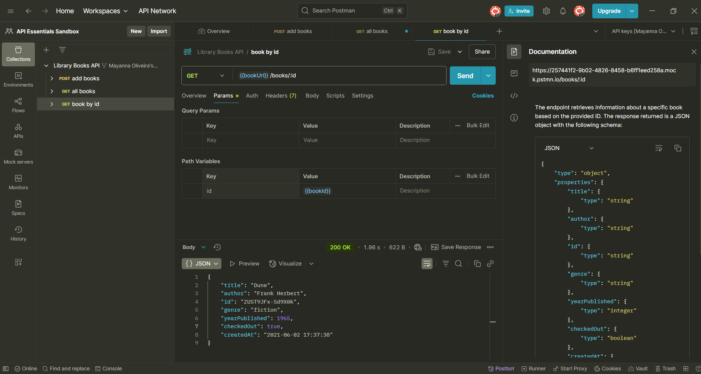
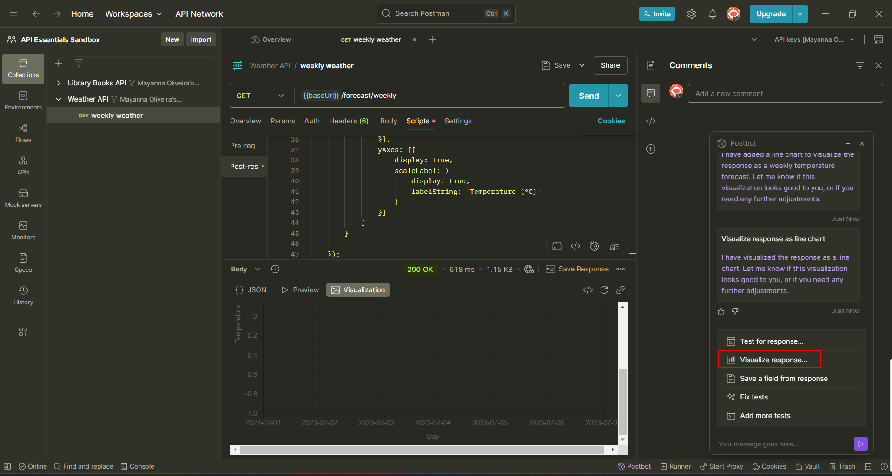
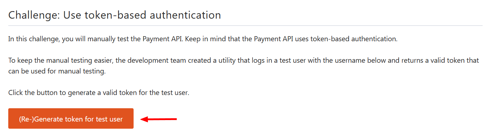
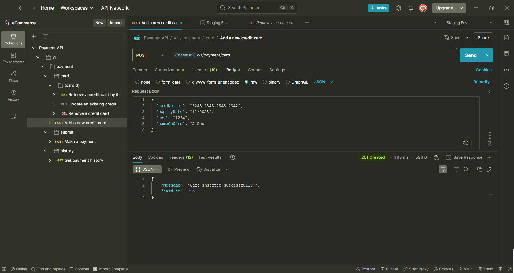

[](https://academy.postman.com/)  

Repository to save my path in learning modules of Self-Study Learning in site [Postman Academy](https://academy.postman.com/).

<!-- TOC -->

- [Challenge: POST add book](#challenge-post-add-book)
  - [Library Books API : POST add books Test.](#library-books-api-post-add-books-test)
  - [Library Books API  : GET all books Tests](#library-books-api-get-all-books-tests)
  - [Library Books API  : GET book by id Documentation](#library-books-api-get-book-by-id-documentation)
  - [Weather API  : GET weekly weather Visualizations](#weather-api-get-weekly-weather-visualizations)
- [API authentication and authorization](#api-authentication-and-authorization)

<!-- TOC -->
 
## Challenge: POST add book
#### Library Books API : POST add books Test.

1. Fork the Library Books API from the [Public API Essentials Workspace](https://www.postman.com/devrel/api-essentials/overview?utm_campaign=fy25--global-all-api_essentials_collaboration-&utm_medium=workshop&utm_source=postman_academy);
2. `Library Books API  > (POST) add books > Body > Add Test` in `{{bookTitle}}` variable;
3. Run the POST requet to add a new book `Test`;
4. Check on `"message": "OK"`.

#### Library Books API  : GET all books Tests

1. Request all books and check Test Results
2. Open the test `Library Books API  > (GET) all books`;
3. Click on `Postbot > Add tests to this request > Fix tests`;
4. The variable `{{base_Url}}` is `https://postman-library-api.glitch.me`;
5. Run the GET request in `Library Books API  > (GET) all books`;
6. Send a GET request to check all books.

#### Library Books API  : GET book by id Documentation

1. Request all books and check Test Results
2. Open the test `Library Books API  > (GET) books by id`;
3. Check if response was 200, successful.
4. Use Postbot to create a contract test.
5. Add the API documentation`Postbot > Add documentation`;
6. Check on the documentation.

The example without token in my repository, file to import `Library_Books_API_postman_collection.json`.
Saved file: [](./ Library_Books_API_postman_collection..json)

#### Weather API  : GET weekly weather Visualizations

1. Fork **Weather API** collection;
2. Select `GET weekly weathe`r request and send the request;
3. Click on `Postbot > Visualize the response`  and change the type of visualization (bar chart, table or line chart);
4. Check the response in visualization tab.

The example without token in my repository, file to import `Weather_API_postman_collection.json`.
Saved file: [](./Weather_API_postman_collection.json)

---
##  API authentication and authorization
Postman Challenge of use token-based authentication. Please follow the steps.
1. Create workspace `eCommerce`;
2. Import the Payment API: `https://customer-education.postmanlabs.com/apis/payment/index.yaml`;
3. Create a new environment named as `Staging Env` and a variable `baseUrl`, type `default` and initial value as `https://customer-education.postmanlabs.com`;
4. Click on button `(Re-)Generate token for test user` to create a token and user;

5. `Payment API > v1 > payment > card > {cardId} > Add a new credit card` the API will ask the authenticator after run the post request `Add a new credit card`;
6. Create a Bearer Token: `Add a new credit card > Authorization´ insert the token in `{{token}}` valiable;
7. Add the script above in `Add a new credit card > Body´; 
8. Run again the API and check on the result: 
```
{
    "message": "Card inserted successfully.",
    "card_id": 754
}
```
Body in step 7:
```json
 {
  "cardNumber": "3243-2343-2343-2342",
  "expiryDate": "11/2023",
  "cvv": "1234",
  "nameOnCard": "J Doe"
}
```

The example without token in my repository, file to import `Payment_API_postman_collection.json`.
Saved file: [](./Payment_API_postman_collection.json)

 
 