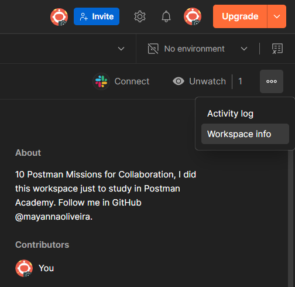

#### Mission 01: Workspaces and forking

Learn to create and manage workspaces for building and sharing your Postman assets, including forking collections to duplicate missions within your workspace. After fork the collections check the overview to understand step-by-step.

1. Get the workspace ID, click in `Mission 01: Workspaces and forking` and `Project > Workspace > > Info > Copy Id;
2. Workspace (Mission 01: Workspaces and forking) > Submit. 
3. Copy the workspace id. `Workspace > Settings > Info`;

4. Insert the workspace id in variable `{{workspaceId}}` and Postman API Key in variable `{{postman_api_key}}`.
5. Send the request and check the `200 OK` result.