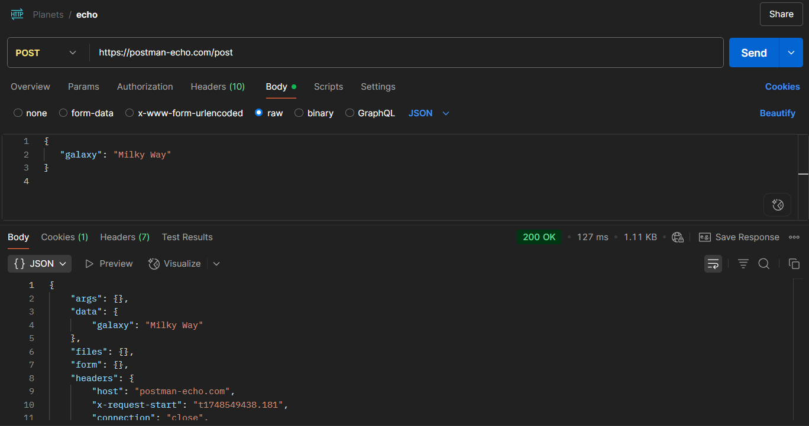

#### Mission 02: Requests, collections and environments

Explore Postman's requests, environments, and collections to manage API interactions, customize testing environments, and streamline workflows for effective collaboration.

##### Requests, collections, and environments
1. Create a new collection called Planets;
2. Insert a new POST request `https://postman-echo.com/post`;
3. Insert this param in the `POST Echo > Body`.
```json
{
   "galaxy": "Milky Way"
}
```
4. Send the request and check the OK result;



5. submit collection;
5. Copy the `GET submit collection` to Planets collection;
6. Insert the `Postman API Key` in variable `{{environmentUid}}`;
7. Send the requet and check the result.

 